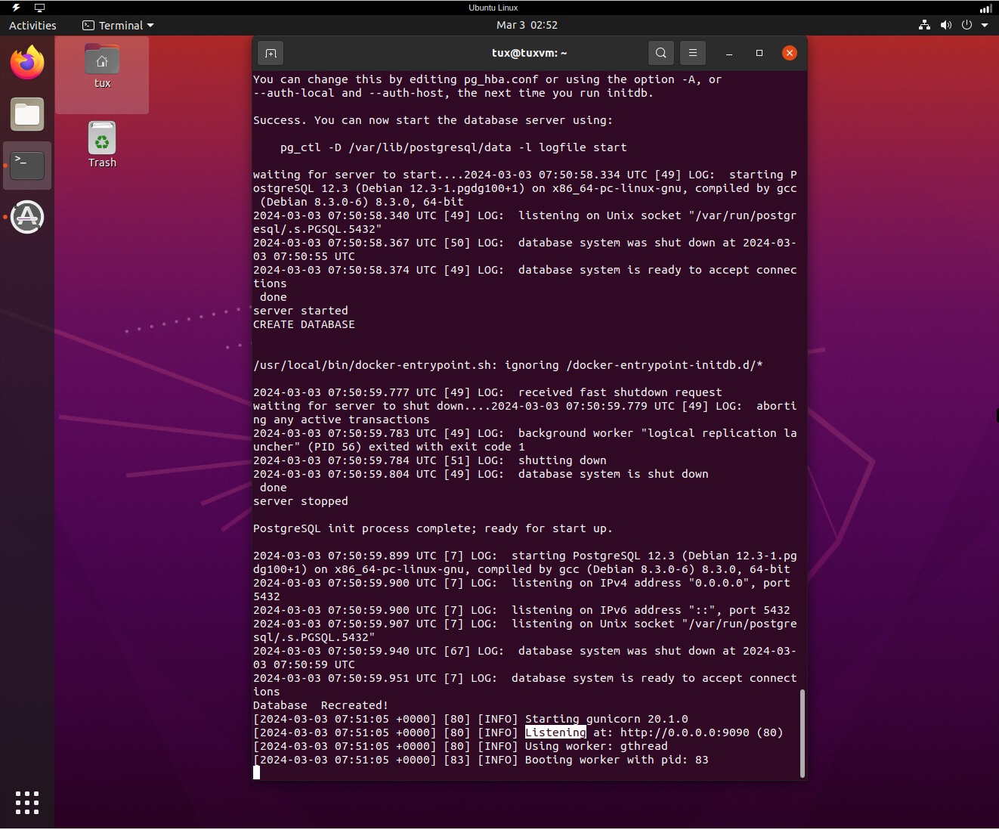
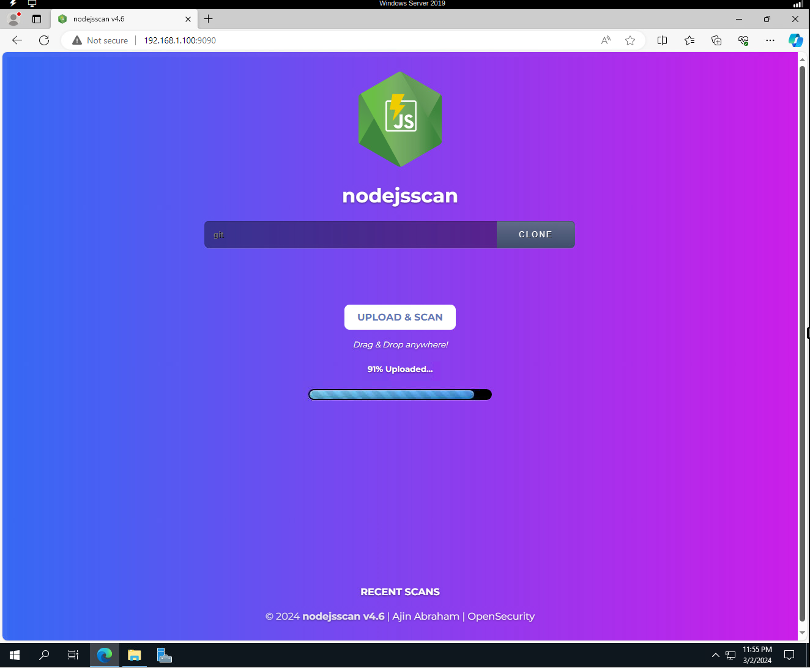
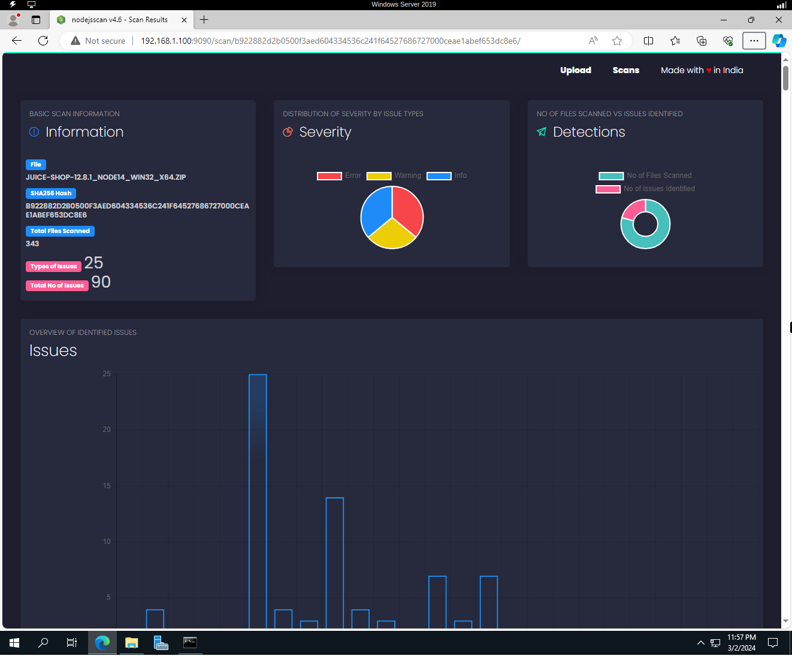
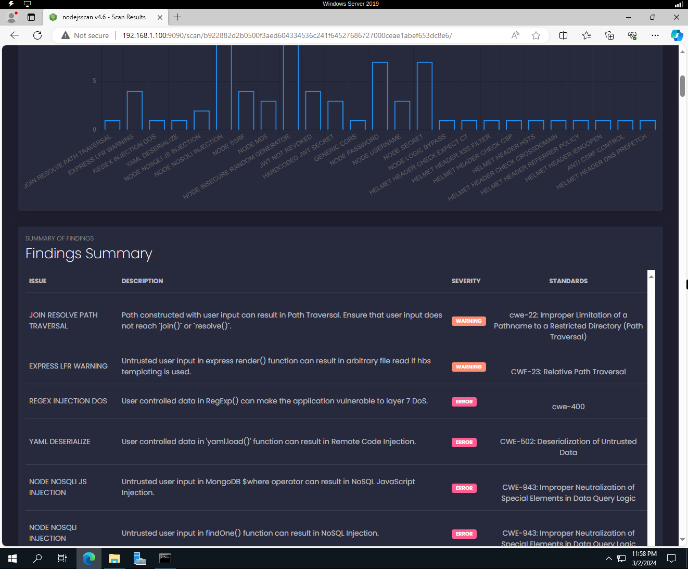
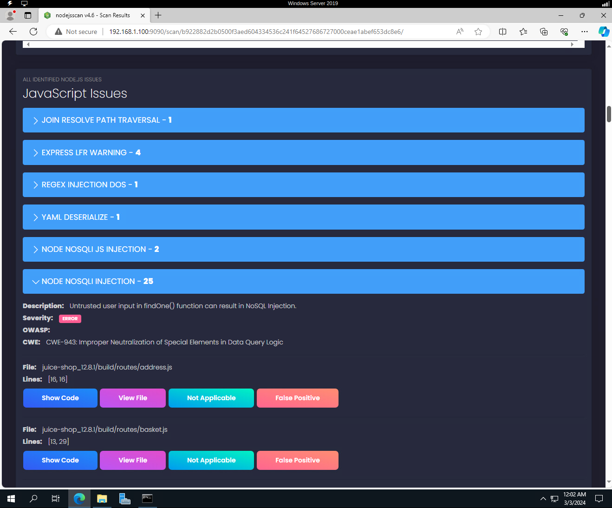
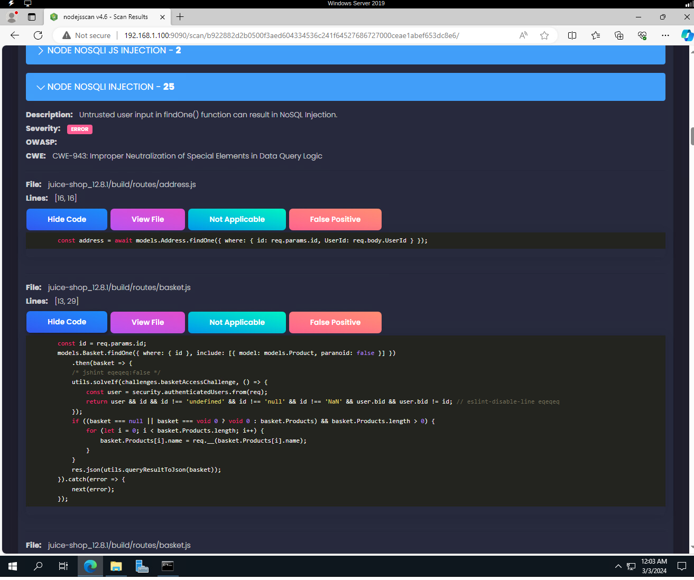
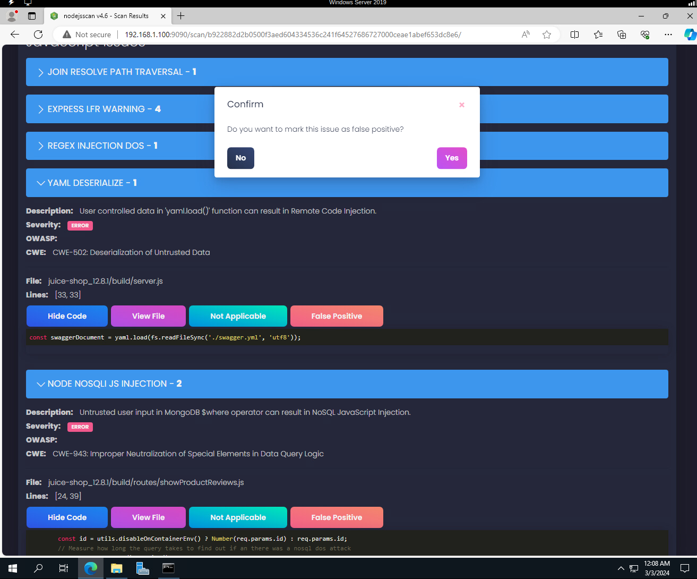
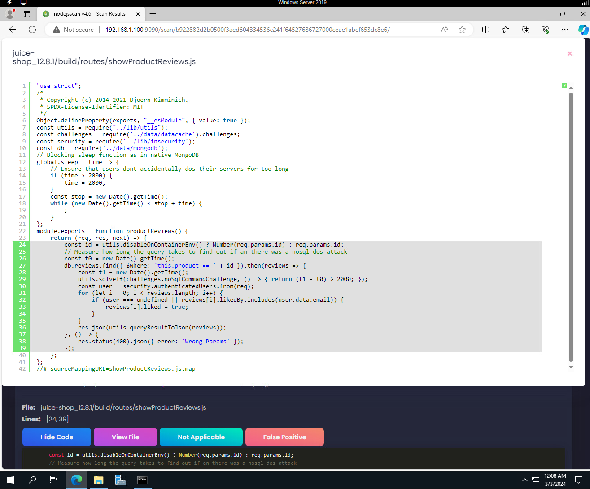
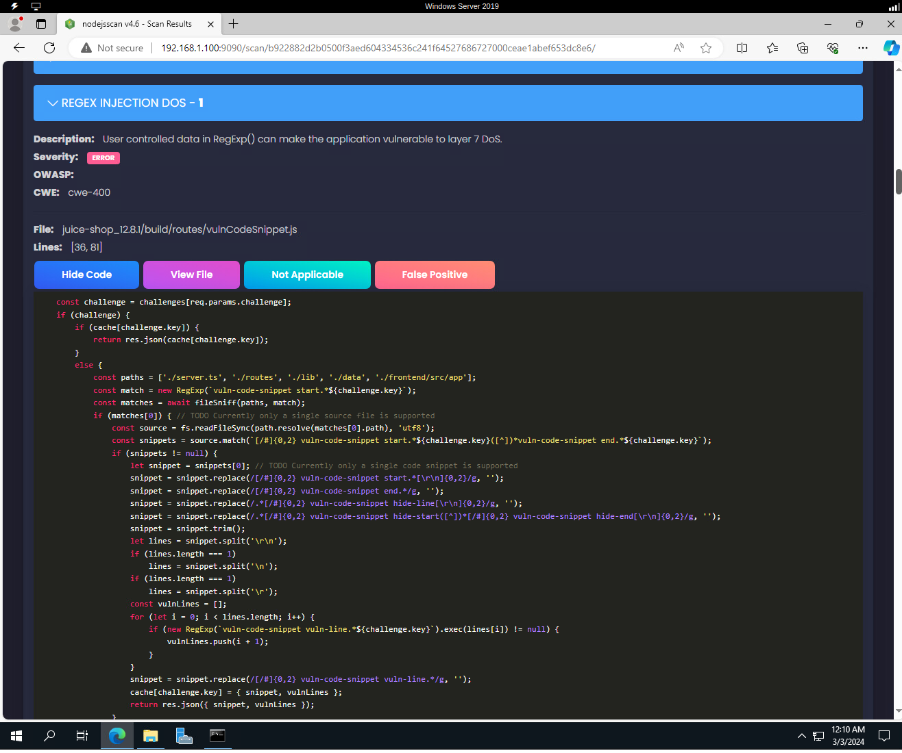
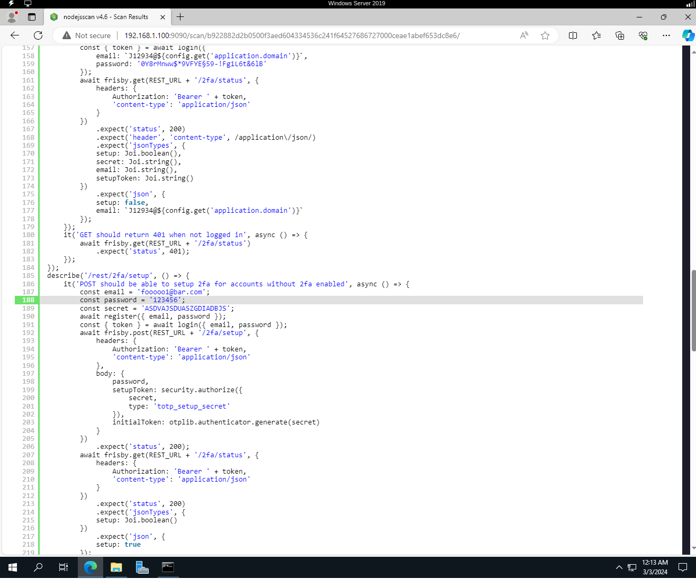

# sast 🍏🍹
sast : Static Application Security Testing # nodejsscan # OWASP # Juice Shop # sca

## Objective
To perform Static Code Analysis on Juice Shop Web Application.
To analyze, identify and locate coding vulnerabilities/issues.

## Nodejsscan SAST

